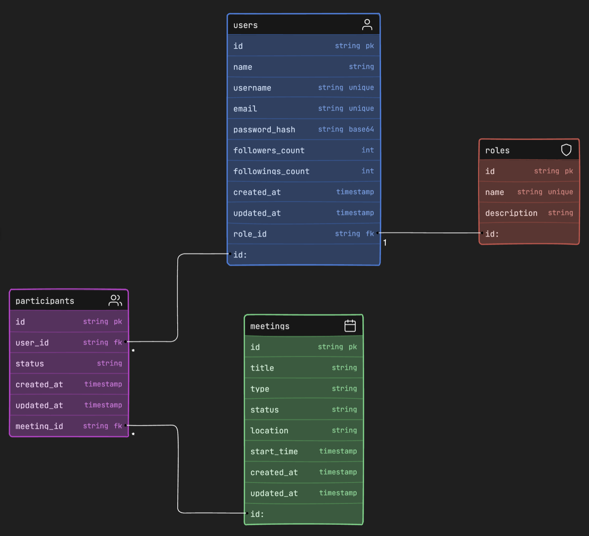

<Note>
  This comprehensive API reference provides battle-tested endpoints for building scheduling and social interaction features. Our REST API enables you to manage users, follow relationships, and authentication seamlessly.
</Note>



## Welcome

This API exposes endpoints to manage users, meetings, follow relationships, and authentication. It powers scheduling and interactions across the platform.

## Authentication

Most endpoints require Bearer token authentication. Public routes such as login and fetching public-facing data do not require auth.

Authentication is defined via the `bearerAuth` scheme in the OpenAPI spec:

```json
"security": [
  {
    "bearerAuth": []
  }
]
